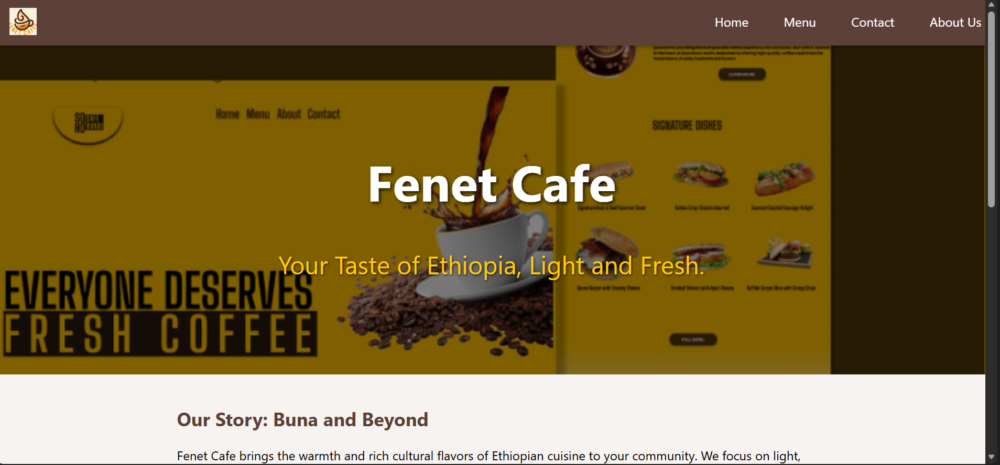

# Fenet Cafe Menu

## Screenshots


A full-stack cafe website with a React frontend and an Express + MongoDB backend.

## Features
- Menu listing with search and category filtering
- Dynamic images per menu item
- Contact form with backend storage
- Admin dashboard for menu management and image uploads
- Health check endpoint
- Basic security hardening (helmet, rate limiting, compression)

## Requirements
- Node.js 18+ recommended
- MongoDB connection string

## Setup (Development)
1. Backend
```powershell
cd backend
npm install
copy .env.example .env
npm run seed
npm start
```

2. Frontend
```powershell
cd frontend
npm install
npm start
```

The frontend runs on `http://localhost:3000` and the backend runs on `http://localhost:5000`.

## Environment Variables
Backend (`backend/.env`)
```
MONGO_URI=your_mongodb_connection_string
PORT=5000
NODE_ENV=development
CORS_ORIGIN=http://localhost:3000
ADMIN_USERNAME=admin
ADMIN_PASSWORD=change_me
ADMIN_PASSWORD_HASH=
SESSION_SECRET=change_me
```

Frontend (`frontend/.env`)
```
REACT_APP_API_URL=http://localhost:5000
```

## Admin Uploads
- Go to `/admin` and sign in with `ADMIN_USERNAME` / `ADMIN_PASSWORD`
- Uploads are limited to 2MB and images only
- If Cloudinary is configured, uploads go to Cloudinary and return a public URL
- Otherwise, uploads are stored locally and served from `/uploads/<filename>`

## Cloud Image Storage (Recommended for Production)
Set the following in `backend/.env`:
```
CLOUDINARY_CLOUD_NAME=your_cloud_name
CLOUDINARY_API_KEY=your_api_key
CLOUDINARY_API_SECRET=your_api_secret
CLOUDINARY_FOLDER=fenet-cafe
```


